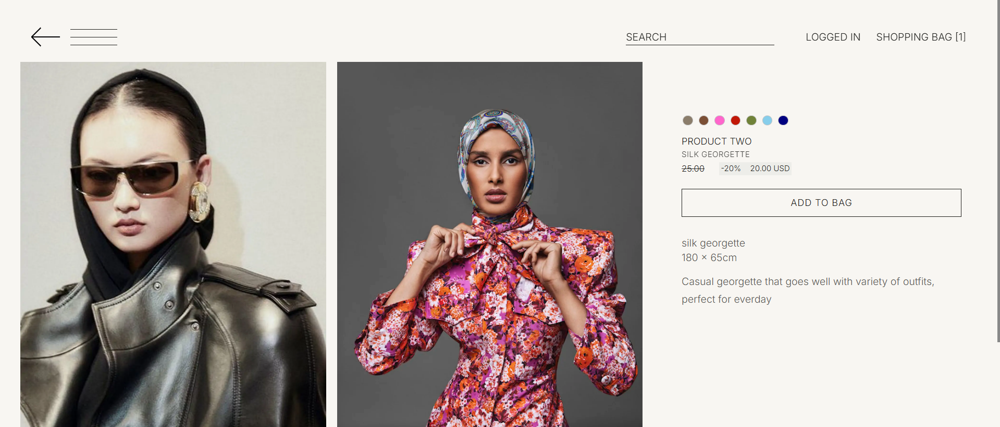
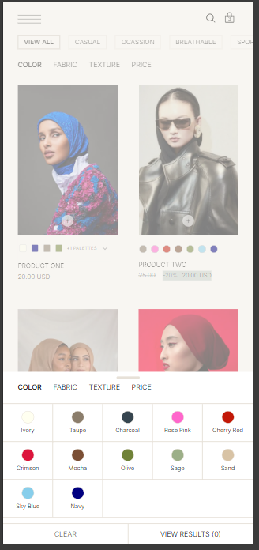

# LUCE — Fashion Ecommerce Platform

LUCE is a personal full-stack fashion ecommerce platform built with React, TypeScript, ASP.NET Core, PostgreSQL, and Lucene.NET.

The project focuses on creating a premium, mobile-first shopping experience for scarves and modest fashion products, with careful attention to product presentation, search quality, color handling, recommendations, and responsive UI behavior.

The source code is private, but this repository presents the product concept, UI/UX direction, screenshots, architecture, and implementation thinking behind the platform.

---

## Preview

---

## Overview

LUCE is designed around the way fashion products are actually browsed and purchased.

The platform supports a variety of fashion products, with special handling for plain and printed scarves, color variants, palette-based products, and essential accessories. The interface is intentionally minimal and product-first, using photography, spacing, color, and subtle interactions to create a premium shopping experience without overwhelming the customer.

The project is not only a storefront UI. It includes business-specific product modeling, intelligent search, dynamic filtering, color-aware recommendations, admin catalog management, and backend architecture designed around maintainability and performance.

---

## Tech Stack

### Frontend

- React + TypeScript
- Responsive, mobile-first UI
- Native CSS with TypeScript-driven interactions
- Custom bottom sheets, overlays, and touch interactions without a heavy UI component framework
- Selective Framer Motion usage for isolated micro-transitions

### Backend

- ASP.NET Core Web API
- PostgreSQL
- Entity Framework Core
- Layered Controller-Service-Repository architecture using ASP.NET Core Dependency Injection
- Lucene.NET-powered search service
- Server-side image processing with ImageSharp

### Product Discovery

- Lucene.NET full-text indexing and retrieval
- Taxonomy-aware query interpretation
- Exact, analyzed, and fuzzy matching
- Edit-distance typo tolerance
- Dynamic faceting and refinements
- Intent-aware constraints for category, fabric, color, and texture searches
- Color-intent-aware matching and ranking

---

## Search and Reliability Highlights

The search system is designed to preserve user intent while still handling imperfect queries, missing terms, and changing catalog data.

Key implementation details include:

- Intent-preserving query behavior across category, fabric, color, and texture constraints
- Staged retrieval pipeline using strict, relaxed, and fallback search phases
- Deterministic hit merging to avoid duplicate or unstable result ordering
- Search UX metadata such as did-you-mean suggestions, search outcome hints, and matched color chips
- Versioned caching with explicit invalidation when catalog/search data changes
- Media data integrity through database-authoritative image mapping and file-existence validation

---

## Product and UX Direction

The app is designed with a mobile-first, app-like shopping experience.

The UI is intentionally restrained. Instead of relying on heavy visual effects, the design uses large product images, generous spacing, subtle typography, soft transitions, and clear product hierarchy.

Important UX decisions include:

- Full-screen immersive homepage hero
- Purpose-based navigation with category imagery
- Large product cards with minimal visual noise
- Bottom sheets for filters, product details, and recommendations
- Scroll-reactive filter and tag bars
- Swipe-aware mobile interactions
- Desktop layouts that preserve the same premium visual direction while using the available space more effectively

---

## Navigation

The navigation is built around customer intent instead of a simple dropdown menu.

Customers can browse through main and child categories with supporting imagery. One category section is opened by default, giving the customer a clear starting point while still exposing the full product structure.

Example categories include:

- Rectangular scarves
- Squared scarves
- Instant scarves
- Underscarves
- Extensions
- Accessories

---

## Product Grid

The product grid is designed to keep attention on the products.

It uses large imagery, generous padding, minimal card chrome, quick product actions, and color or palette indicators depending on the product type.

---

## Plain and Printed Product Behavior

Plain and printed products are presented differently to match how customers browse them.

Plain products can show selectable color swatches that update the product image. Printed products can show a compact palette preview, with fuller color details available in the product detail view.

This keeps the product grid minimal while preserving accurate color and variant behavior.

---

## Product Details

Product details can be opened without interrupting the browsing flow.

On mobile, product information appears in a bottom sheet. On desktop, it appears as a larger modal-style view over the product grid.

The detail view includes product images, price, sale price, fabric, dimensions, description, add-to-bag action, and color or palette information.

---

## Search and Product Discovery

Search is built with Lucene.NET and designed around real ecommerce discovery behavior.

The search system supports exact matching, analyzed matching, fuzzy fallback, stemming, typo tolerance, edit-distance correction, taxonomy-aware ranking, and attribute-aware product matching.

It understands product concepts such as:

- Main and child categories
- Colors
- Fabrics
- Textures
- Product types
- Printed palette colors
- Plain selectable colors

For example, when searching by color, a plain scarf can show a direct matching swatch, while a printed scarf can match because the print contains that color. The search results respect the difference instead of flattening both products into the same behavior.

---

## Filters

Filters are designed to be easy to reach without taking over the shopping experience.

The product listing supports dynamic filters such as color, fabric, texture, price, and category tags. Color filters are generated from the current product set and sorted using LAB color distance, giving the color list a more natural visual order than random or alphabetical sorting.

On mobile, filters appear in a bottom sheet with a native-feeling interaction pattern.

---

## Recommendations

When a customer adds a scarf to the cart, the platform can recommend a matching essential item.

Essentials are products marked by the admin, such as bonnets, underscarves, pins, and accessories.

The recommendation logic follows a fallback chain:

1. Find an essential product with the same color.
2. If no exact match exists, find a visually similar shade using LAB color distance.
3. If no similar shade exists, fall back to neutral essentials such as ivory or off-white.
4. Show additional tailored recommendations below the main suggestion.

This makes recommendations feel connected to the selected product instead of random.

---

## Cart

The cart is designed as part of the shopping experience rather than a disconnected final page.

It supports product review, quantity updates, variant-aware cart items, item deletion, and total price display in a mobile-first layout.

---

## Admin and Catalog Management

The platform includes admin-facing catalog workflows for managing products, attributes, media, inventory, and product discovery data.

Admin functionality includes:

- Product creation and editing through a multi-step workspace
- Category, fabric, texture, tag, color, pricing, and inventory management
- Attribute library workflows for maintaining reusable catalog metadata
- Plain versus printed product configuration
- Product-level and color-specific image mapping
- Draft autosave for product creation flows
- Database-authoritative media selection with file-existence validation
- Server-side media optimization with WebP conversion, EXIF removal, and generated thumbnail/detail/hero variants
- Essential product marking for recommendation behavior

---

## Backend Architecture

The backend follows a layered architecture:

`Controller → Service → Repository → DbContext → PostgreSQL`

The backend is responsible for product catalog management, categories, colors, palettes, product images, inventory behavior, essential product marking, recommendation logic, and Lucene.NET search indexing.

The project models ecommerce behavior beyond generic CRUD by encoding variant, palette, search, and recommendation rules into the product model.

---

## Data Modeling

The relational model includes concepts such as:

- Products
- Product colors
- Product images
- Printed palettes
- Dominant colors
- Main and child categories
- Fabrics
- Textures
- Tags
- Inventory
- Essential products
- Recommendation attributes

The model is designed so the frontend can behave correctly without relying on fragile UI-only assumptions.

For example:

- Plain color selection maps to real product color and image data.
- Printed palettes are handled differently from plain color variants.
- Search can distinguish direct color matches from contained palette colors.
- Recommendations can use selected color, product type, color family, and fallback neutral colors.

---

## Performance Considerations

The platform is built with attention to practical performance concerns.

Important considerations include:

- Avoiding N+1 query patterns
- Returning product card data in frontend-friendly shapes
- Separating Lucene search results from relational product retrieval
- Avoiding unnecessary over-fetching
- Keeping product discovery queries efficient
- Optimizing uploaded product media into purpose-specific WebP variants
- Using versioned cache keys and explicit invalidation for stale-data control
- Designing APIs around actual UI usage instead of generic data dumping

---

## What This Project Demonstrates

LUCE demonstrates full-stack product engineering across frontend, backend, search, data modeling, and UX.

It highlights:

- Premium mobile-first UI design
- Responsive desktop and mobile layouts
- App-like ecommerce interactions
- Custom touch behavior without a heavy UI component framework
- Business-specific relational modeling
- Lucene.NET search integration
- Taxonomy-aware filtering and query interpretation
- Dynamic color and palette systems
- LAB-distance color matching
- Intelligent recommendations
- Performance-aware backend design
- Clean separation between controllers, services, repositories, and database logic
