# LUCE Ecommerce Platform Showcase

LUCE is a full-stack ecommerce platform designed for modest fashion and headscarf retail.

The project was built from the perspective of a business owner in a niche retail space where generic ecommerce tools often fall short. LUCE focuses on a premium mobile-first storefront, structured catalog discovery, secure account flows, and admin workflows that support real product preparation before launch.

The source code is private. This repository presents the product concept, UI/UX direction, screenshots, architecture, and implementation approach without exposing the full domain or business logic.

Current test deployment: [https://luce-byi.pages.dev/](https://luce-byi.pages.dev/)

I designed and implemented the full UI/UX, frontend, backend, search, recommendation logic, authentication model, and admin workflows end to end.

---

## Preview


---

## What I Built

LUCE is a full-stack ecommerce system shaped around how modest fashion and scarf products are browsed, styled, searched, managed, and sold.

It includes:

- A premium responsive storefront with a mobile-first, app-like feel
- Category discovery tailored to the product domain
- Product grids with color and palette-aware presentation
- Product detail and quick-view flows optimized for uninterrupted browsing
- Lucene.NET-powered structured search with suggestions and refinements
- Context-aware recommendation surfaces
- Cart flows with contextual recommendations
- Customer authentication architecture with refresh-token-based sessions
- Admin catalog tooling for products, media, inventory, attributes, and merchandising metadata
- Backend architecture designed around maintainability, performance, and secure account flows

---

## Current Demo Status

The project is currently deployed in a test environment at [https://luce-byi.pages.dev/](https://luce-byi.pages.dev/).

Important notes:

- The deployed app currently includes a small amount of mock/demo data.
- Product images are mock images while final photography and catalog preparation are pending.
- The catalog will be updated continuously as more data is prepared.
- Mock data is currently available through Categories, with the default opened category exposing `VIEW ALL` for now.
- Data can be added through the admin form page. Contact me if you want temporary admin access for review.
- Customer login is designed around WhatsApp-based phone verification. The customer-facing WhatsApp delivery is not enabled yet because the final WhatsApp Business number has not been added/bought.
- The authentication logic is implemented and currently supports development/test verification flow until the final WhatsApp Business setup is connected.

---

## Why This Product Exists

Many small fashion retailers rely on generic ecommerce tools that treat every product like a simple item with a name, price, and image.

That is often not enough for specialized fashion catalogs, where product presentation, variants, discovery, styling context, and merchandising details affect the shopping experience.

LUCE models those requirements in the platform while keeping the public showcase focused on product engineering, UX, and architecture rather than exposing internal commercial rules.

---

## Invariant-First Design

The implementation follows an invariant-first design approach: important product rules are enforced in the data model, backend services, and admin workflows before the UI depends on them.

Examples include keeping media mappings, product variants, stock state, catalog attributes, and account/session behavior consistent across storefront, cart, search, and admin flows. This reduces fragile UI-only assumptions and keeps the system easier to maintain as the catalog grows.

---

## Tech Stack

### Frontend

- React + TypeScript
- Responsive, mobile-first UI
- Zustand for lightweight client-side state management
- Native CSS with TypeScript-driven interactions
- Custom bottom sheets, overlays, and touch interactions
- Selective Framer Motion usage for isolated micro-transitions

### Backend

- ASP.NET Core Web API
- PostgreSQL
- Entity Framework Core
- Layered Controller-Service-Repository architecture
- JWT authentication with database-backed refresh tokens
- Lucene.NET search service
- Server-side image processing with ImageSharp

### Media Pipeline

- Uploaded product media is converted to WebP server-side with ImageSharp.
- Standard product uploads generate four storefront-ready versions: thumbnail, compact, detail preview, and detail.
- Hero images can generate an additional hero-sized version when used for editorial or landing-page surfaces.
- The goal is to keep image usage explicit instead of serving oversized originals into every UI context.

---

## Product Experience

The storefront is intentionally restrained and product-led. It uses large imagery, generous spacing, subtle typography, soft transitions, and minimal card chrome so the catalog feels premium instead of noisy.

The mobile experience uses familiar app-like patterns such as bottom sheets, quick views, swipe-aware interactions, scroll-reactive controls, and full-screen discovery surfaces. Desktop layouts preserve the same visual direction while using the available space for richer browsing.


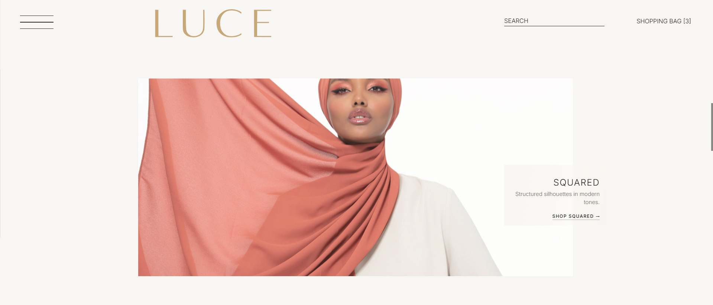

---

## Navigation And Discovery

Navigation is organized around how customers shop the catalog instead of relying only on generic menu labels.

Customers can browse product groups with supporting imagery. In the demo, Categories currently opens with `VIEW ALL` as the default broad entry point.

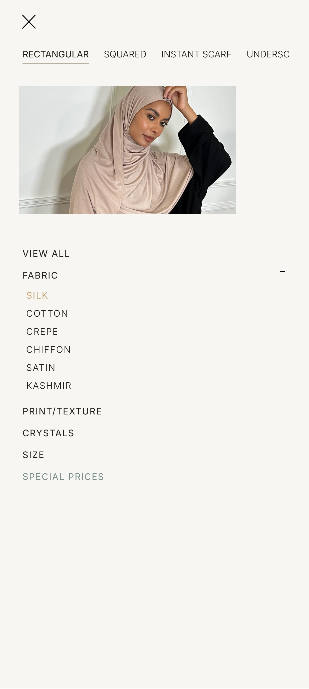

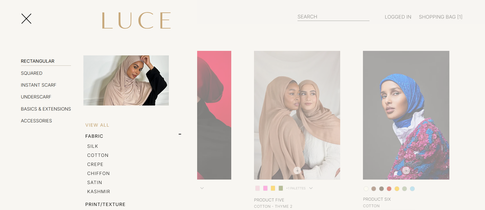

---

## Product Browsing

The product grid keeps attention on the products while still exposing the information needed for confident browsing.

Products can show variant-aware visuals and compact color or palette indicators, with fuller details available from the product detail or quick-view flow.

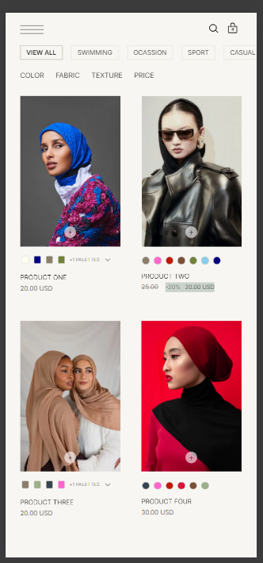

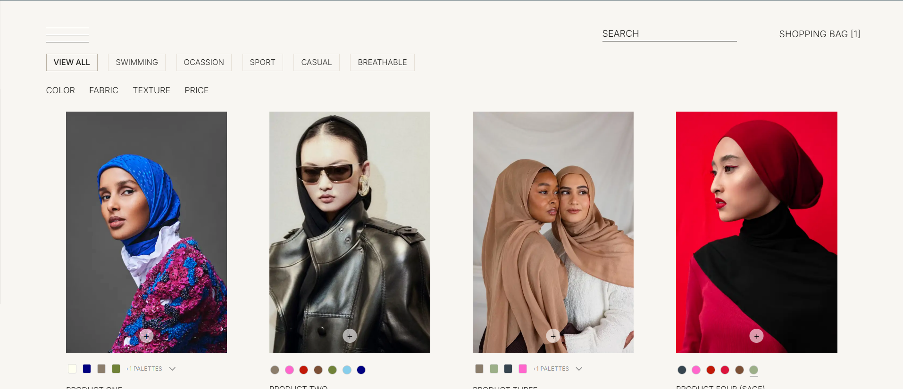

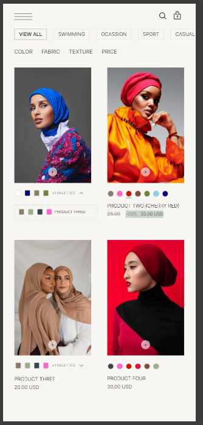

Product details open without interrupting the browsing flow. On mobile, details appear in a bottom sheet. On desktop, they appear as a modal-style view over the product grid.

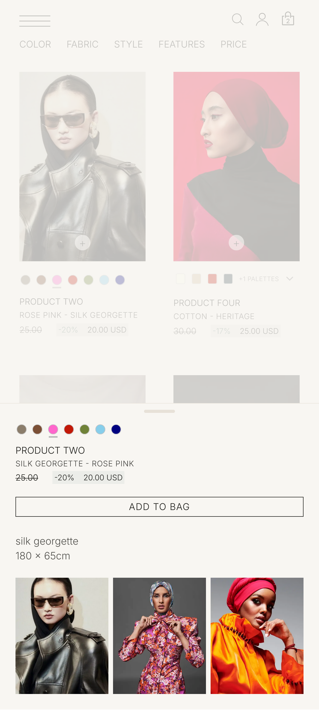

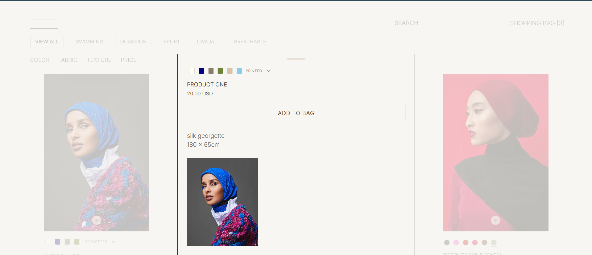

---

## Search And Recommendations

Search is powered by Lucene.NET and designed around structured ecommerce discovery, not only free-text product lookup.

The system supports attribute-aware results, suggestions, refinements, and typo-tolerant behavior while keeping the storefront experience simple for customers.

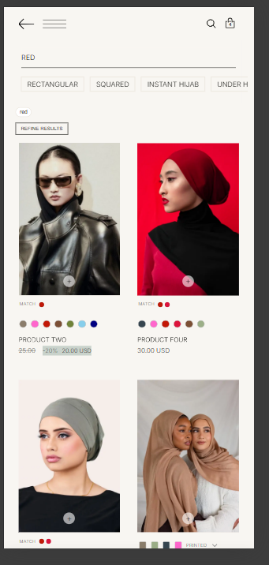

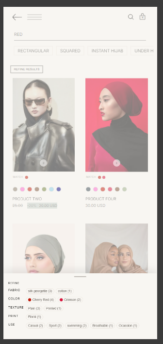

Recommendations are placement-aware and context-aware. They support multiple storefront surfaces without treating every product as the same kind of upsell.

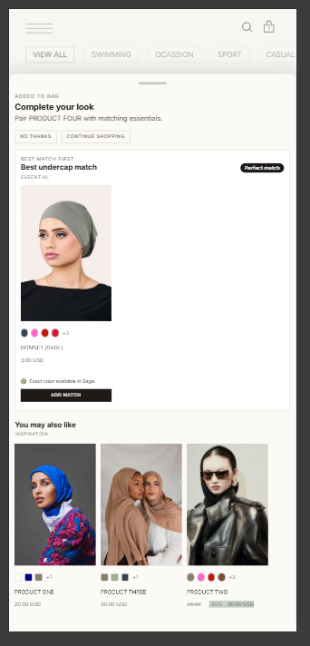

Detailed writeups:

- [Search design](docs/search.md)
- [Recommendation system](docs/recommendations.md)

---

## Cart And Account Flow

The cart is designed as part of the shopping experience rather than a disconnected final page. It supports variant-aware cart items, quantity updates, item deletion, total price display, and contextual recommendations.

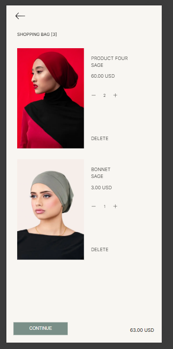

Customer accounts are designed around phone verification, short-lived JWT access tokens, and database-backed refresh tokens stored in `HttpOnly` cookies. Guest browsing remains available.

In the current test deployment, the customer WhatsApp login flow is not connected to a production WhatsApp Business number yet. The supporting logic is available and will be enabled in the final stage once the WhatsApp Business number is added.

Detailed writeup:

- [Authentication model](docs/auth.md)

---

## Admin Platform

The admin workspace supports catalog workflows where product imagery, attributes, stock state, search behavior, and merchandising metadata directly affect the storefront.

Admin functionality includes product creation and editing, reusable attribute libraries, category and inventory management, variant-aware configuration, media mapping, media validation, and merchandising fields.

The test deployment can be reviewed with mock data. If you want access to the admin form page to add or inspect data, contact me for a temporary login.

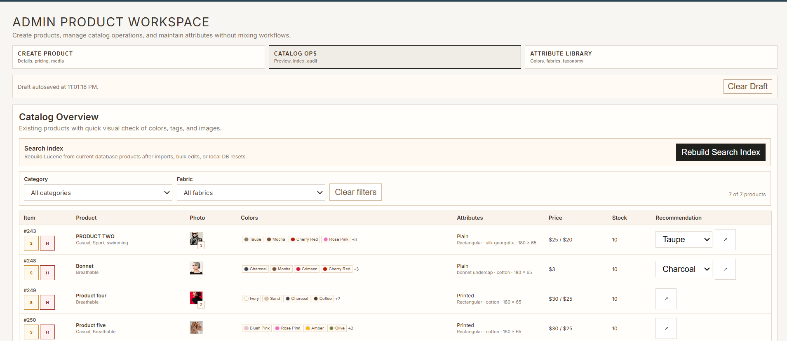

Detailed writeup:

- [Admin workflows](docs/admin-workflows.md)

---

## Architecture Highlights

The backend follows a layered architecture:

```txt
Controller -> Service -> Repository -> DbContext -> PostgreSQL
```

The platform separates storefront behavior, catalog management, search indexing, recommendations, authentication, and media handling into focused backend responsibilities. Lucene search results are separated from relational product retrieval, and performance-sensitive areas are designed with practical caching, indexing, and bounded result handling.

Detailed writeups:

- [Architecture](docs/architecture.md)
- [Data modeling](docs/data-modeling.md)
- [Performance considerations](docs/performance.md)

---

## What This Demonstrates

LUCE demonstrates full-stack product engineering across frontend, backend, search, data modeling, authentication, recommendations, admin tooling, and UX.

The strongest parts of the project are:

- Building software around a real business domain rather than a generic demo brief
- Translating specialized catalog behavior into data models, UI flows, and backend boundaries
- Applying invariant-first design so important catalog rules are enforced consistently
- Designing a premium mobile-first ecommerce experience
- Implementing structured Lucene.NET search with suggestions and refinements
- Building context-aware recommendation surfaces
- Designing secure account sessions with refresh-token rotation
- Creating admin workflows that support real catalog operations
- Thinking about performance, maintainability, and launch-readiness from the start
